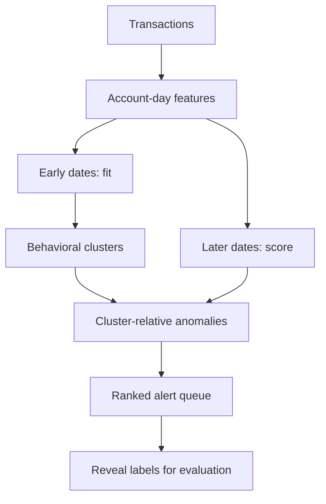

<div align="center">

# SignalGraph AML

**Explainable unsupervised detection of suspicious banking activity**

[](https://github.com/lidonmiguel/signalgraph-aml/actions/workflows/ci.yml)


</div>

SignalGraph AML is a portfolio-ready financial-crime analytics project. It learns ordinary
account behavior, discovers customer segments, and ranks unusual account-days for human review.
The model never sees laundering labels during training; ground truth is revealed only after
scoring to measure performance under a fixed investigation budget.

> **Decision problem:** if an AML team can investigate only 100 alerts today, which accounts
> should it review first—and why?

## What is already working

- A deterministic synthetic demo, so the complete project runs without restricted bank data.
- IBM AML schema validation and account-day feature engineering.
- Temporal training on the earliest 70% of dates.
- Behavioral segmentation with MiniBatch K-Means.
- Cluster-relative anomaly scoring with Isolation Forest.
- Human-readable alert reasons and a two-dimensional behavior map.
- Precision@K, recall@K, PR-AUC, lift, and suspicious value detected.
- A dark Streamlit investigation console with a ranked queue and account network explorer.
- Tests, linting, GitHub Actions, a CLI, and Docker support.

The fixed-seed demo currently finds 32 of 36 positive account-days in the top 100 alerts
(88.9% recall and 8.36× lift). These are **demo smoke-test results**, not claims about performance
on real banking data. Benchmark results belong in a separate experiment using the IBM dataset.

## Dashboard

The application contains four analyst views:

1. **Behavior map** — PCA projection colored by anomaly risk, with an alert-capacity threshold.
2. **Investigation queue** — cases ranked by risk with interpretable alert reasons.
3. **Network explorer** — a one-hop view of counterparties and value moved on the alert date.
4. **Methodology** — a concise record of the leakage-aware experimental design.

Ground-truth outcomes are hidden by default and can be revealed for evaluation.

## Quick start

```bash
git clone https://github.com/lidonmiguel/signalgraph-aml.git
cd signalgraph-aml
python -m venv .venv
source .venv/bin/activate
python -m pip install -e ".[dev]"
streamlit run app.py
```

Run the reproducible command-line demo:

```bash
signalgraph-aml --demo --alert-budget 100
```

This writes the trained model, scored cases, investigation queue, and metrics to `artifacts/`.

## Use the IBM AML benchmark

1. Download `HI-Small_Trans.csv` from the
   [IBM Transactions for Anti Money Laundering dataset on Kaggle](https://www.kaggle.com/datasets/ealtman2019/ibm-transactions-for-anti-money-laundering-aml).
2. Place it at `data/raw/HI-Small_Trans.csv`. Raw data is git-ignored.
3. Run:

```bash
signalgraph-aml \
  --input data/raw/HI-Small_Trans.csv \
  --output-dir artifacts/ibm-hi-small \
  --alert-budget 100
```

The small benchmark contains roughly five million transactions. Use a machine with at least
8 GB of available memory for the current pandas pipeline. For quick plumbing checks, create a
smaller local CSV while retaining every positive row; do not use that biased sample to report
model quality.

The dataset is synthetic because real AML transactions are private and incompletely labeled.
IBM's generator provides complete ground truth and known transaction patterns, making it useful
for controlled benchmarking. See the [data card](docs/DATA_CARD.md) for provenance and caveats.

## Modeling approach



Features cover transaction velocity, incoming and outgoing value, counterparties, bank diversity,
active hours, payment format, cross-currency behavior, flow imbalance, and reciprocal relationships.
Skewed features receive `log1p` transforms and robust scaling.

Risk is a transparent operational score:

```text
risk = 0.82 × within-cluster anomaly percentile
     + 0.18 × distance-from-cluster-center percentile
```

See the [model card](docs/MODEL_CARD.md) for assumptions, intended use, and limitations.

## Repository layout

```text
signalgraph-aml/
├── app.py                         # Streamlit investigation console
├── src/signalgraph_aml/
│   ├── data.py                    # ingestion, validation, demo generator
│   ├── features.py                # account-day behavioral features
│   ├── modeling.py                # clustering, anomalies, explanations
│   ├── evaluation.py              # top-K operational metrics
│   └── pipeline.py                # reproducible CLI
├── tests/                         # unit and leakage tests
├── docs/                          # data and model cards
├── .github/workflows/ci.yml
├── Dockerfile
└── pyproject.toml
```

## Quality checks

```bash
make check
```

The tests verify IBM column normalization, deterministic demo generation, unique and complete
account-day features, strict temporal splitting, label exclusion, bounded risk scores, and top-K
metric calculations.

## Roadmap

- [ ] Run and document the full IBM HI-Small benchmark.
- [ ] Add graph-motif features for fan-in, fan-out, rapid cycles, and scatter-gather behavior.
- [ ] Compare K-Means with HDBSCAN on a representative account sample.
- [ ] Add experiment tracking and feature-drift monitoring.
- [ ] Publish a hosted read-only dashboard with precomputed, non-sensitive artifacts.

## Responsible use

This project prioritizes investigation; it does not determine guilt, freeze accounts, or replace
an AML analyst. An anomaly is unusual, not necessarily illicit. Any real deployment would require
privacy controls, model validation, bias testing, audit trails, drift monitoring, and human review.
