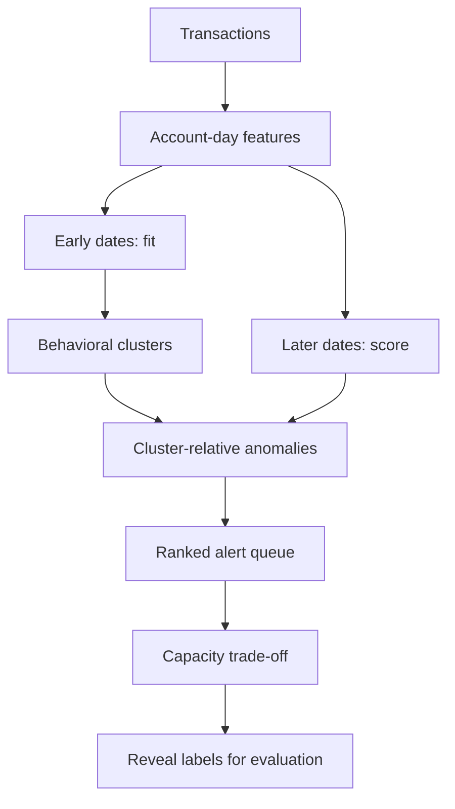

<div align="center">

# SignalGraph AML

**Explainable unsupervised detection of suspicious banking activity**

[](https://github.com/lidonmiguel/signalgraph-aml/actions/workflows/ci.yml)


[](LICENSE)

</div>

SignalGraph AML is a portfolio-ready financial-crime analytics project. It learns ordinary
account behavior, discovers customer segments, and ranks unusual account-days for human review.
The model never sees laundering labels during training; ground truth is revealed only after
scoring to measure performance under a fixed investigation budget.

> **Decision problem:** if an AML team can investigate only 100 alerts today, which accounts
> should it review first—and why?

## Live portfolio

**[Explore the published SignalGraph AML benchmark →](https://lidonmiguel.github.io/signalgraph-aml/)**


## What is already working

- A deterministic synthetic demo, so the complete project runs without restricted bank data.
- IBM AML schema validation and account-day feature engineering.
- Rolling fan-in and fan-out, ordered three-account cycles, and scatter-gather paths.
- Temporal training on complete early dates closest to 70% of account-day volume.
- Behavioral segmentation with MiniBatch K-Means.
- Cluster-relative anomaly scoring with Isolation Forest.
- Human-readable alert reasons and a two-dimensional behavior map.
- Precision/recall capacity planning, PR-AUC, lift, and positive-case value selected.
- Data-driven names and median profiles for every behavioral segment.
- Multi-factor explanations that expose small denominators such as “1 of 1 (100%).”
- A dark Streamlit investigation console with a ranked queue and account network explorer.
- Tests, linting, GitHub Actions, a CLI, and Docker support.

Demo metrics are **smoke-test results**, not claims about performance on real banking data.
The repository includes a separate, auditable IBM benchmark command that records the input hash,
software environment, runtime, capacity curve, and segment profiles.

## Dashboard

The application includes a read-only benchmark summary built entirely from committed,
non-sensitive artifacts. The local Streamlit application provides the full interactive workflow.

The application opens on a published, read-only IBM benchmark and includes six analyst views:

1. **IBM benchmark** — precomputed full-data metrics, capacity curves, segment profiles, and an
   auditable reproducibility record without shipping raw transactions.
2. **Behavior map** — PCA projection colored by anomaly risk, with an alert-capacity threshold.
3. **Capacity planning** — precision and recall across different analyst workloads.
4. **Investigation queue** — cases ranked by risk with interpretable alert reasons.
5. **Network explorer** — a one-hop view of counterparties and value moved on the alert date.
6. **Methodology** — a concise record of the leakage-aware experimental design.

Ground-truth outcomes are hidden by default and can be revealed for evaluation.

## Quick start

```bash
git clone https://github.com/lidonmiguel/signalgraph-aml.git
cd signalgraph-aml
python -m venv .venv
source .venv/bin/activate
python -m pip install -e ".[dev]"
streamlit run app.py
```

Run the reproducible command-line demo:

```bash
signalgraph-aml --demo --alert-budget 100
```

This writes the trained model, scored cases, investigation queue, and metrics to `artifacts/`.

## Use the IBM AML benchmark

1. Download `HI-Small_Trans.csv` from the
   [IBM Transactions for Anti Money Laundering dataset on Kaggle](https://www.kaggle.com/datasets/ealtman2019/ibm-transactions-for-anti-money-laundering-aml).
2. Place it at `data/raw/HI-Small_Trans.csv`. Raw data is git-ignored.
3. Run the auditable benchmark:

```bash
signalgraph-benchmark \
  --input data/raw/HI-Small_Trans.csv \
  --output-dir artifacts/ibm-hi-small \
  --report-dir docs/benchmarks/ibm-hi-small \
  --capacities 50 100 250 500 1000
```

PowerShell users can place the command on one line or replace each `\` with a backtick.

The command keeps large models and scored case files under the ignored `artifacts/` directory and
writes only the small, commit-ready report tables to `docs/benchmarks/ibm-hi-small/`.

### Compare clustering methods

Install the optional comparison dependencies, then run both methods on the same training-account
sample and later account-days:

```bash
python -m pip install -e ".[dev,comparison]"
signalgraph-compare-clusters \
  --input data/raw/HI-Small_Trans.csv \
  --output-dir artifacts/cluster-comparison \
  --report-dir docs/benchmarks/cluster-comparison \
  --sample-cases 20000 \
  --min-cluster-sizes 50 100 200 \
  --min-samples 15 \
  --capacities 50 100 250 500 1000
```

PowerShell users can run the command on one line. A quick dependency and scoring check uses
`signalgraph-compare-clusters --demo --min-cluster-sizes 30 60` and writes only to `artifacts/`.
The full input run repeats feature engineering; allow time and memory comparable to the existing
benchmark plus HDBSCAN fits. The resulting `COMPARISON_REPORT.md` and `comparison_summary.json`
contain aggregate results, no raw transaction or case tables. Commit the generated report only
after running the full CSV. The roadmap comparison remains pending until that report is reviewed.

The full-training K-Means model is an operational reference. A sampled K-Means model and all
HDBSCAN settings share a training sample, scaler, and anomaly-only score. An HDBSCAN noise case
uses a global anomaly reference; later dates are assigned to existing clusters without refitting.
The experiment does not replace the dashboard model. See the
[benchmark instructions](docs/benchmarks/README.md) for interpretation.

### Published HI-Small result

The committed figures below are a historical baseline from commit
[`f4ede61`](https://github.com/lidonmiguel/signalgraph-aml/commit/f4ede61f7105eb132a3acb64aa5dae13f77489c5),
before graph-motif features were added to the model. They are not measured results for the
updated model. Rerun the benchmark on the same input CSV to compare model versions.

The committed [IBM HI-Small benchmark report](docs/benchmarks/ibm-hi-small/BENCHMARK_REPORT.md)
uses 5,078,345 transactions and a strict out-of-time evaluation containing 720,800 account-days.
At a review budget of 100 cases across the held-out queue, the model finds 20 positive account-days:
**20.0% precision**, **0.61% recall**, and **43.94× lift** over random selection. PR-AUC is 0.0118
against a 0.00455 positive prevalence. The high lift and low recall show the intended operational
trade-off: a small analyst queue is strongly enriched but cannot cover every generated laundering
case.

The small benchmark contains roughly five million transactions. Use a machine with at least
8 GB of available memory for the current pandas pipeline. For quick plumbing checks, create a
smaller local CSV while retaining every positive row; do not use that biased sample to report
model quality.

The dataset is synthetic because real AML transactions are private and incompletely labeled.
IBM's generator provides complete ground truth and known transaction patterns, making it useful
for controlled benchmarking. See the [data card](docs/DATA_CARD.md) for provenance and caveats.

## Modeling approach


```mermaid
flowchart TD
    A["Transactions"] --> B["Account-day features"]
    B --> C["Early dates: fit"]
    B --> D["Later dates: score"]
    C --> E["Behavioral clusters"]
    E --> F["Cluster-relative anomalies"]
    D --> F
    F --> G["Ranked alert queue"]
    G --> H["Capacity trade-off"]
    H --> I["Reveal labels for evaluation"]
```

Features cover transaction velocity, value, counterparties, banks, active hours, payment format,
currencies, flow imbalance, and reciprocal relationships. Graph motifs add the maximum distinct
outgoing recipients and incoming senders in trailing 60-minute windows; a three- or four-account
directed cycle (A→B→C→A or A→B→C→D→A); and a scatter-gather diamond (A→B,C→D). Cycle
edges are strictly ordered; both scatter transfers precede both gather transfers, whose
timestamps must differ. Motifs complete within three hours. Windows may cross midnight and
are assigned to the completion day; no feature uses a future transaction.
Skewed features receive `log1p` transforms and robust scaling.

Risk is a transparent operational score:

```text
risk = 0.82 × within-cluster anomaly percentile
     + 0.18 × distance-from-cluster-center percentile
```

See the [model card](docs/MODEL_CARD.md) for assumptions, intended use, and limitations.

## Repository layout

```text
signalgraph-aml/
├── app.py                         # Streamlit investigation console
├── src/signalgraph_aml/
│   ├── data.py                    # ingestion, validation, demo generator
│   ├── features.py                # account-day behavioral features
│   ├── modeling.py                # clustering, anomalies, explanations
│   ├── evaluation.py              # top-K operational metrics
│   ├── profiling.py               # data-driven segment descriptions
│   ├── benchmark.py               # IBM benchmark and report generator
│   ├── cluster_comparison.py      # sampled K-Means and HDBSCAN experiment
│   └── pipeline.py                # reproducible CLI
├── tests/                         # unit and leakage tests
├── docs/                          # data and model cards
├── .github/workflows/ci.yml
├── Dockerfile
└── pyproject.toml
```

## Quality checks

```bash
make check
```

The tests verify IBM column normalization, deterministic demo generation, unique and complete
account-day features, strict temporal splitting, label exclusion, bounded risk scores, and top-K
metric calculations.

## Roadmap

- [x] Add a reproducible IBM HI-Small benchmark and report workflow.
- [x] Run it on `HI-Small_Trans.csv` and commit the generated report.
- [x] Add graph-motif features for fan-in, fan-out, rapid cycles, and scatter-gather behavior.
- [ ] Compare K-Means with HDBSCAN on a representative account sample.
- [ ] Add experiment tracking and feature-drift monitoring.
- [ ] Publish a hosted read-only dashboard with precomputed, non-sensitive artifacts.

## Responsible use

This project prioritizes investigation; it does not determine guilt, freeze accounts, or replace
an AML analyst. An anomaly is unusual, not necessarily illicit. Any real deployment would require
privacy controls, model validation, bias testing, audit trails, drift monitoring, and human review.

## License

The project code is released under the [MIT License](LICENSE). The IBM AML dataset is not included
in this repository and remains governed by its own CDLA-Sharing-1.0 terms. See the
[data card](docs/DATA_CARD.md) for provenance and usage constraints.
